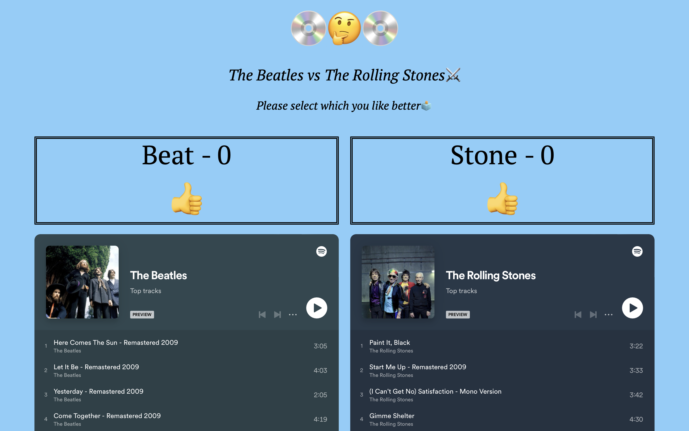
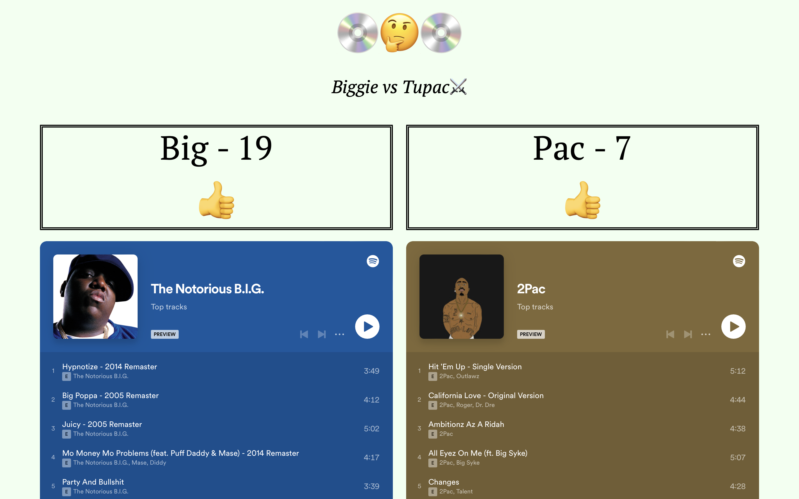
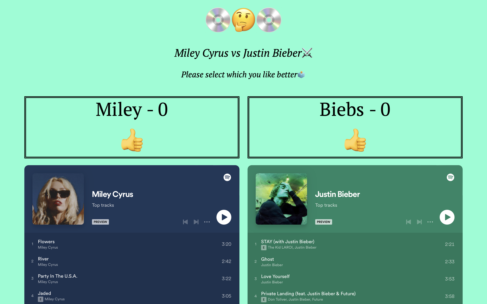
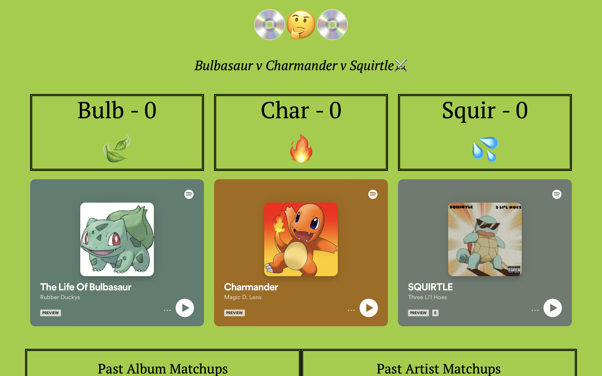
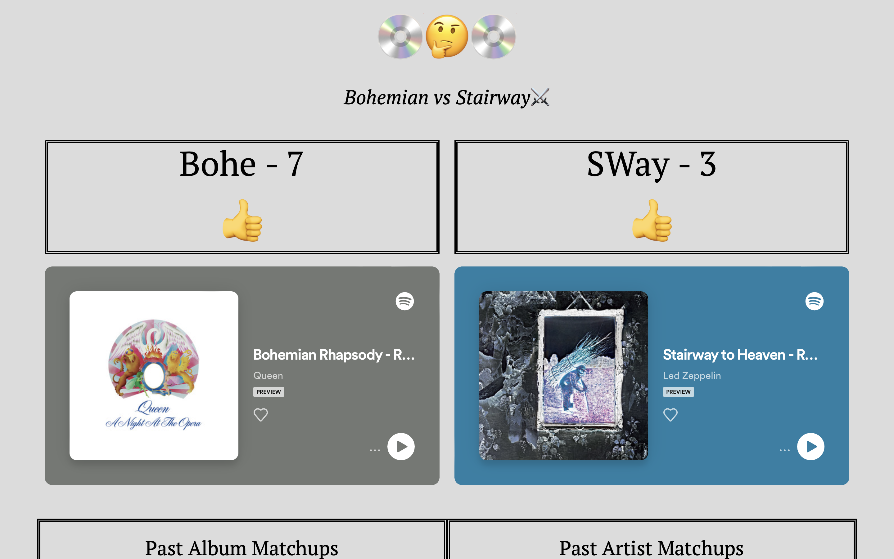
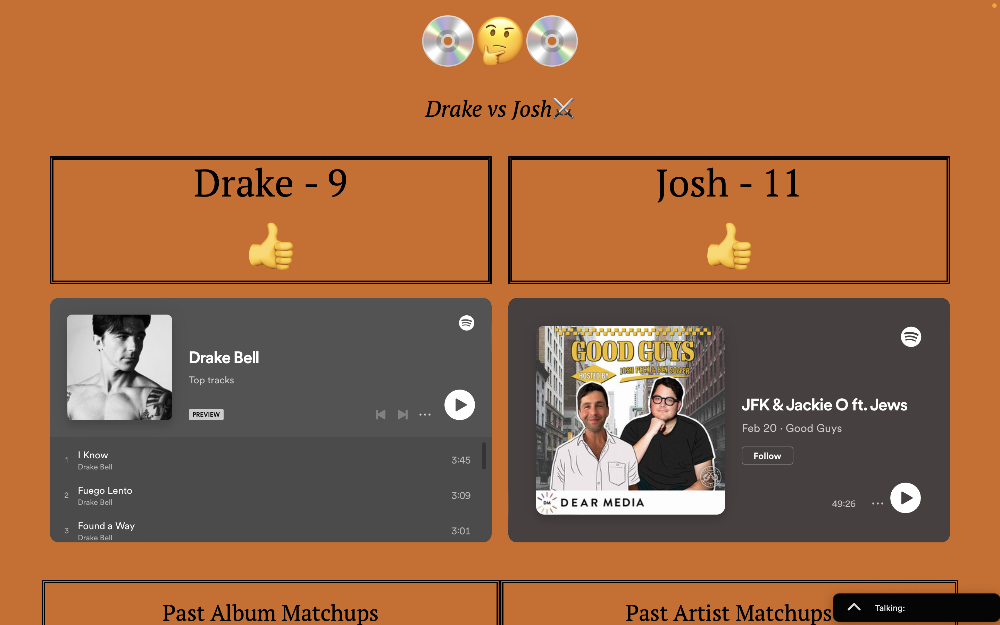

# dookie
Head to head matchup application powered by HTML, CSS, & JS


<br>

## 💡 Table of Contents

- [Description](#description-id)
- [Languages](#languages-id)
- [Installation](#installation-id)
- [Usage](#usage-id)
- [Links](#links-id)
- [Screenshots](#screenshots-id)

<br>

> <strong>Deployed Heroku link: https://elite-matchups.herokuapp.com</strong>

<br>

## <a id="description-id"></a>Description
This website is a head to head matchup application created with HTML, CSS, JavaScript, and a small JSON database. Once a matchup is set, users can vote by simply clicking the like button (or whatever emoji is set). Voters can only vote once per matchup. Usually, it is a matchup between 2 things, but it has gone up to 4 (All 4 Beatles). Matchups **can** happen again. The votes are completely anonymous as well. Enjoy😎

<br>

## <a id="languages-id"></a>Languages

```js
- HTML
- CSS
- JavaScript
- db.JSON
```
> Links for learning these languages can be found <a href="#links-id">below</a>

<br>

## <a id="installation-id"></a>Installation
There are no installation steps required for this app😁

<br>

## <a id="usage-id"></a>Usage
Upon arriving to the site (https://elite-matchups.herokuapp.com), you will see a header with the current matchup in italicized writing. Scroll down further to see the current matchup, usually between two artists, albums, songs, or movies, but can be anything. Clicking the emoji under either option bumps their score up 1 point and you are not able to vote again (currently, you can on another browser). The score is then updated live and can be seen by any user on the application at any tinme. Usually, matchups are set daily by the creator, but they can go on for longer🤩

<br>

## <a id="links-id"></a>Links
The author is a developer with a GitHub account: https://github.com/ScottsC0de & email: **Scott5902@gmail.com**<br>
<br>
Heroku link: https://elite-matchups.herokuapp.com<hr>
GitHub project repo: https://github.com/ScottsC0de/dookie <hr>
HTML: https://www.w3schools.com/html/default.asp<hr>
CSS: https://www.w3schools.com/css/default.asp<hr>
JavaScript: https://www.w3schools.com/js/default.asp<hr>
db.JSON: https://www.npmjs.com/package/db-json<hr>
Another great resource: https://www.freecodecamp.org


<br>

## <a id="screenshots-id"></a>Screenshots

<br>


<br>


<br>


<br>


<br>


